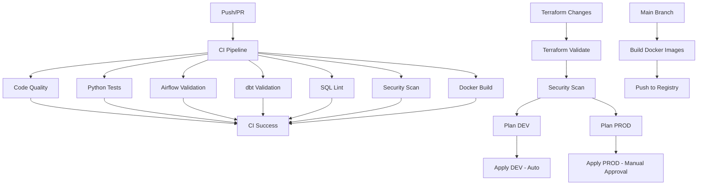

# Banking Big Data Platform: E2E Data Engineering & DevOps

## 1. Architecture Overview

This project implements a scalable, enterprise-grade banking data platform using modern Data Engineering and DevOps best practices. It ingests, processes, models, and serves banking data at scale using **AWS, Snowflake, Spark, Airflow, dbt, Data Vault 2.0, Docker, Terraform, and Kubernetes.**

### Platform Workflow

1. **Ingestion:** Batch and real-time data from core systems (Payments, CRM, Core Banking) are ingested via **Spark** and **Kafka**. [[00:10](http://www.youtube.com/watch?v=5NCywQcJ2r8&t=10)]
2. **Storage:** Raw data is stored in the **AWS S3 Bronze Layer** (Immutable).
3. **Processing:** **PySpark** jobs perform cleansing and validation, moving data to the **Silver Layer**.
4. **Modeling:** **dbt** transforms data in **Snowflake** using the **Data Vault 2.0** methodology (Hubs, Links, Satellites). [[08:51](http://www.youtube.com/watch?v=5NCywQcJ2r8&t=531)]
5. **Orchestration:** **Airflow** manages the end-to-end dependency graph. [[14:25](http://www.youtube.com/watch?v=5NCywQcJ2r8&t=865)]
6. **Serving:** Curated data is delivered to **Snowflake Marts** for BI tools like **Power BI**. [[15:30](http://www.youtube.com/watch?v=5NCywQcJ2r8&t=930)]

---

## 2. CI/CD & Infrastructure Flow



---

## 3. Project Structure

```text
NILOOMID-banking-data-platform/
├── .github/workflows/          # CI/CD: Terraform & Python/dbt pipelines
├── infrastructure/terraform/   # IaC for AWS (S3, EKS) & Snowflake (DB, WH)
├── k8s/                        # Kubernetes Manifests for Airflow & Spark
├── dags/                       # Airflow DAGs (S3-to-Snowflake, dbt runs)
├── dbt/                        # dbt Core project (Data Vault 2.0 Modeling)
│   ├── models/
│   │   ├── staging/            # Initial cleaning [00:10:51]
│   │   ├── vault/              # Hubs, Links, Satellites
│   │   └── marts/              # Business-ready views [00:11:24]
├── spark_jobs/                 # PySpark ETL for Bronze/Silver layers
├── docker/                     # Dockerfiles for platform components
├── scripts/                    # Setup and deployment utilities
└── docs/                       # Architecture and design documentation

```

---

## 4. Key Features

* **Data Vault 2.0:** Implements a scalable, historized model for auditability.
* **Infrastructure as Code (IaC):** Full platform automation via Terraform.
* **Containerization:** Spark and Airflow running on Kubernetes (EKS).
* **Data Quality:** Automated testing via dbt tests and Spark validation. [[06:41](http://www.youtube.com/watch?v=5NCywQcJ2r8&t=401)]
* **Lineage Tracking:** End-to-end visibility of data flow via dbt Cloud/Studio. [[14:25](http://www.youtube.com/watch?v=5NCywQcJ2r8&t=865)]

---

## 5. Getting Started

### Prerequisites

* AWS CLI & Account
* Terraform 1.5+
* Snowflake Account [[02:07](http://www.youtube.com/watch?v=5NCywQcJ2r8&t=127)]
* Docker & Kubernetes (kubectl)

### Quick Setup

1. **Clone & Configure:**
```bash
git clone https://github.com/NILOOMID/banking-data-platform.git
cp .env.example .env

```


2. **Deploy Infrastructure:**
```bash
cd infrastructure/terraform/env/dev
terraform init && terraform apply

```


3. **Deploy K8s Services:**
```bash
kubectl apply -f k8s/

```


4. **Run dbt Transformations:**
```bash
cd dbt
dbt build # Runs models and tests [00:05:51]

```


---

## 6. Data Vault Layer Reference

| Type | Table Example | Purpose |
| --- | --- | --- |
| **Hub** | `hub_customer` | Unique business keys (Customer ID, Account ID). |
| **Link** | `link_customer_account` | Relationships between entities. |
| **Satellite** | `sat_customer_details` | Descriptive attributes & history (SCD Type 2). |

---

## 7. Security & Secrets Management

Ensure the following secrets are configured in your GitHub Repository Settings:

* `AWS_ACCESS_KEY_ID_DEV` / `AWS_SECRET_ACCESS_KEY_DEV`
* `SNOWFLAKE_ACCOUNT` / `SNOWFLAKE_USER_DEV` / `SNOWFLAKE_PASSWORD_DEV`

---

## 8. Monitoring & Visualization

* **Airflow UI:** Monitor DAG execution and task logs.
* **Snowflake:** Query history and storage monitoring.
* **Power BI:** Final analytics dashboards (e.g., Customer 360). [[16:36](http://www.youtube.com/watch?v=5NCywQcJ2r8&t=996)]

---

**References:**

* [Data Vault 2.0 Standards](https://danlinstedt.com/datavault-2-0/)
* [dbt Best Practices](https://docs.getdbt.com/)
* [Video Tutorial Guide](https://www.youtube.com/watch?v=5NCywQcJ2r8)
