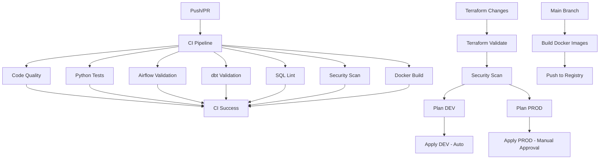

# Domain: Banking Big Data Platform

**Project Overview**  
This project demonstrates a scalable, enterprise-grade banking data platform using modern Data Engineering and DevOps best practices. It ingests, processes, models, and serves banking data at scale using **AWS, Snowflake, Spark, Airflow, dbt, Data Vault, Docker, Terraform, and Kubernetes (K8s).**

[](https://www.terraform.io/)
[](https://www.snowflake.com/)
[](https://www.getdbt.com/)
[](https://kubernetes.io/)


<p align="left">   
       


## 1. Architecture Overview


**Components & Flow:**

| Layer | Technology | Role |
| :--- | :--- | :--- |
| **Ingestion** | PySpark / Kafka | Batch & Streaming ingestion from core banking APIs. |
| **Storage** | AWS S3 (Medallion) | Raw (Bronze), Cleansed (Silver), and Curated (Gold) layers. |
| **Compute** | AWS EKS (K8s) | Distributed processing for Spark and Airflow workers. |
| **Warehouse** | Snowflake | Enterprise Data Vault and Information Marts. |
| **Modeling** | dbt Core | SQL-based transformations and Data Vault automation. |
| **IaC** | Terraform | Environment-as-Code (Dev/Prod isolation). |

---

## 2. Project Folder Structure


```
NILOOMID-banking-data-platform/
├── .github/workflows/          # CI/CD pipelines (GitHub Actions)
├── .gitignore                  # Security: Ignore state files and secrets
├── requirements.txt            # Python dependencies
├── .env               # Environment variable template
├── profiles.yml      # dbt profile template
│
├── docs/                       # Technical documentation
│   ├── SETUP.md                # Environment setup guide
│   ├── DATA_VAULT_DESIGN.md    # Business logic & ERD
│   └── API_DOCUMENTATION.md    # Metadata API docs
│
├── terraform/   # Infrastructure as Code
│   ├── providers.tf            # Version locking (AWS/Snowflake)
│   ├── variables.tf            # Global variable schema
│   ├── modules/                # Reusable Infrastructure Components
│   │   ├── aws/ (s3, eks, iam) # IRSA and S3 security logic
│   │   └── snowflake/          # DB, Warehouse, and RBAC
│   └── env/                    # Environment Instances
│       ├── dev/ (main, vars)   # Sandbox (Spot Instances)
│       └── prod/ (main, vars)  # Production (On-Demand)
│
├── k8s/                             
│   ├── namespace.yaml
│   ├── airflow/
│   │   ├── deployment.yaml
│   │   ├── service.yaml
│   │   └── configmap.yaml
│   ├── spark/
│   │   └── spark-job.yaml
│   └── dbt/
│       └── dbt-runner.yaml
├── dags/                               # Airflow DAGs
│   ├── __init__.py
│   ├── ingestion_dag.py    
│   ├── dbt_dag.py           
│   └── utils/
│       ├── __init__.py
│       └── snowflake_helpers.py
├── dbt/                                # dbt Core Project
│   ├── dbt_project.yml                
│   ├── packages.yml                   
│   ├── selectors.yml                
│   ├── profiles.yml.example           
│   ├── macros/
│   │   ├── generate_schema_name.sql
│   │   ├── hash_key.sql
│   │   └── data_masking.sql
│   ├── models/
│   │   ├── staging/
│   │   │   ├── _sources.yml           # ✅ SOURCE DEFINITIONS
│   │   │   ├── _staging.yml           # ✅ MODEL DOCUMENTATION
│   │   │   ├── stg_customers.sql
│   │   │   ├── stg_accounts.sql
│   │   │   └── stg_transactions.sql
│   │   ├── vault/
│   │   │   ├── hubs/
│   │   │   │   ├── _hubs.yml
│   │   │   │   ├── hub_customer.sql
│   │   │   │   ├── hub_account.sql
│   │   │   │   └── hub_transaction.sql
│   │   │   ├── links/
│   │   │   │   ├── _links.yml
│   │   │   │   ├── link_customer_account.sql
│   │   │   │   └── link_account_transaction.sql
│   │   │   └── satellites/
│   │   │       ├── _satellites.yml
│   │   │       ├── sat_customer_details.sql
│   │   │       ├── sat_account_details.sql
│   │   │       └── sat_transaction_details.sql
│   │   └── marts/
│   │       ├── _marts.yml
│   │       └── mart_customer_360.sql
│   ├── tests/
│   │   ├── generic/
│   │   └── singular/
│   ├── seeds/
│   │   └── country_codes.csv
│   └── snapshots/
│
├── spark_jobs/                         # PySpark ETL Jobs
│   ├── __init__.py
│   ├── bronze_ingestion.py            # Raw data ingestion
│   ├── silver_transform.py            # Data cleansing
│   ├── utils/
│   │   ├── __init__.py
│   │   ├── spark_config.py
│   │   └── data_quality.py
│   └── tests/
│       └── test_transformations.py
│
├── docker/                     # Multi-stage Dockerfiles
│   ├── airflow.Dockerfile
│   ├── dbt.Dockerfile
│   └── spark.Dockerfile
│   └── docker-compose.yml
└── scripts/
    ├── setup_env.sh                   # Environment setup
    ├── deploy.sh                      # Deployment script
    └── init_snowflake.sql             # Snowflake initialization
````

---

## 3. Key Features

- **Data Vault 2.0**: Fully auditable, historized enterprise banking model.
- **Cloud-Native**: AWS S3, Snowflake, K8s-managed Spark and Airflow.
- **Orchestrated Pipelines**: Airflow DAGs for batch and streaming ingestion.
- **Infrastructure as Code (IaC)**: Terraform scripts for reproducible environments.
- **Modular dbt Models**: Hub, Link, Satellite layers for clean data modeling.
- **Containerized Deployment**: Docker + K8s for scalable, portable workloads.
- **Big Data Processing**: Spark handles large transaction and payment datasets efficiently.
- **Security & Governance**: Snowflake role-based access, audit logs, encrypted data at rest.

---

## 4. Getting Started

### Prerequisites

- AWS Account (S3, EC2, EKS)
- Docker & Kubernetes
- Terraform 1.5+
- Python 3.11+
- Snowflake Account
- dbt Core 1.7+
- Apache Airflow 2.8+

### Steps

1. Clone repository:  
```bash
git clone https://github.com/NILOOMID/banking-data-platform.git
cd banking-data-platform
````

2. Provision infrastructure:

```bash
cd terraform/env/dev
terraform init
terraform apply -var-file="terraform.tfvars"
```

3. Deploy K8s workloads:

```bash
kubectl apply -f ../k8s/
```

4. Build and run Docker images:

```bash
docker build -t airflow ./docker/Dockerfile-airflow
docker build -t spark ./docker/Dockerfile-spark
docker build -t dbt ./docker/Dockerfile-dbt
```

5. Trigger Airflow DAGs:

```bash
airflow dags list
airflow dags trigger ingestion_dag
```

6. Run dbt transformations:

```bash
dbt run --project-dir dbt
```

---

## 5. Data Vault Structure

| Type      | Example Table         | Description                            |
| --------- | --------------------- | -------------------------------------- |
| Hub       | hub_customer          | Core entity (customer, account, card)  |
| Link      | link_customer_account | Relationships between hubs             |
| Satellite | sat_customer_profile  | Historical attributes and transactions |

---

## 6. CI/CD

* **GitHub Actions**: Runs dbt tests, Airflow DAG lint, Terraform plan.
* **Docker Hub**: Push container images.
* **K8s Rollouts**: Canary deployments for Spark jobs and Airflow workers.

---

## 7. Monitoring & Logging

* Airflow UI & logs
* Spark job metrics via Prometheus & Grafana
* Snowflake Query History
* CloudWatch logs

---


## 8. References & Standards

* [Data Vault 2.0](https://danlinstedt.com/datavault-2-0/)
* [AWS Well-Architected Framework](https://aws.amazon.com/architecture/well-architected/)
* [dbt Documentation](https://docs.getdbt.com/)
* [Apache Airflow](https://airflow.apache.org/)

```
---
https://www.youtube.com/watch?v=5NCywQcJ2r8


