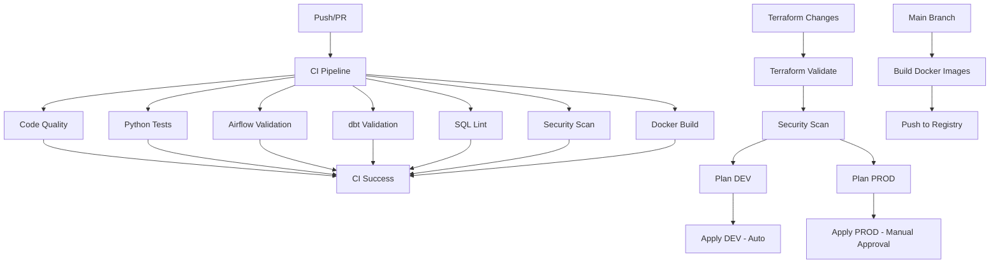

# Domain: Banking Big Data Platform

**Project Overview**  
This project demonstrates a scalable, enterprise-grade banking data platform using modern Data Engineering and DevOps best practices. It ingests, processes, models, and serves banking data at scale using **AWS, Snowflake, Spark, Airflow, dbt, Data Vault, Docker, Terraform, and Kubernetes (K8s).**

---

## 1. Architecture Overview


**Components & Flow:**

| Layer | Tool / Technology | Description |
|-------|-----------------|-------------|
| Data Ingestion | Spark / AWS S3 / Kafka | Batch & real-time ingestion from core banking systems, payment gateways, and CRM. |
| Data Lake / Bronze Layer | AWS S3 | Raw storage layer (immutable, append-only) |
| Data Processing / Silver | Spark / Databricks | Cleansing, validation, transformations, enrichment |
| Data Vault Layer | dbt + Snowflake | Implemented following **Data Vault 2.0** methodology for historization and auditability |
| Orchestration | Airflow | Manage ETL workflows, scheduling, monitoring |
| Infrastructure | Terraform | Automated provisioning of AWS, Snowflake, S3, and K8s clusters |
| Deployment | Docker + Kubernetes | Containerized workflows for Spark jobs, Airflow workers, dbt runs |
| Analytics & Reporting | Snowflake + BI tools | Secure, governed access for analysts & business teams |

---

## 2. Project Folder Structure


```
NILOOMID-banking-data-platform/
AWS_Snowflake_DBT__Project/
├── .github/
│   └── workflows/
│       ├── ci.yml
│       └── terraform-plan.yml
├── .gitignore                          # ✅ MUST CREATE
├── README.md                           # ✅ UPDATE
├── requirements.txt                    # ✅ UPDATE
├── .env.example                        # ✅ CREATE (not .env)
├── profiles.yml.example                # ✅ CREATE (not profiles.yml)
│
├── docs/
│   ├── images/
│   │   └── architecture_diagram.png
│   ├── SETUP.md                        # ✅ CREATE
│   ├── DATA_VAULT_DESIGN.md           # ✅ CREATE
│   └── API_DOCUMENTATION.md
│
├── infrastructure/
│   └── terraform/
│       ├── modules/                    # ✅ CREATE MODULE STRUCTURE
│       │   ├── aws/
│       │   │   ├── s3/
│       │   │   │   ├── main.tf
│       │   │   │   ├── variables.tf
│       │   │   │   └── outputs.tf
│       │   │   └── eks/
│       │   │       ├── main.tf
│       │   │       ├── variables.tf
│       │   │       └── outputs.tf
│       │   └── snowflake/
│       │       ├── database/
│       │       │   ├── main.tf
│       │       │   ├── variables.tf
│       │       │   └── outputs.tf
│       │       └── warehouse/
│       │           ├── main.tf
│       │           ├── variables.tf
│       │           └── outputs.tf
│       └── env/                        # ✅ CREATE ENVIRONMENT STRUCTURE
│           ├── dev/
│           │   ├── main.tf
│           │   ├── variables.tf
│           │   ├── backend.tf
│           │   ├── terraform.tfvars.example
│           │   └── providers.tf
│           └── prod/
│               ├── main.tf
│               ├── variables.tf
│               ├── backend.tf
│               ├── terraform.tfvars.example
│               └── providers.tf
│
├── k8s/                                # ✅ MOVE TO ROOT (per your README)
│   ├── namespace.yaml
│   ├── airflow/
│   │   ├── deployment.yaml
│   │   ├── service.yaml
│   │   └── configmap.yaml
│   ├── spark/
│   │   └── spark-job.yaml
│   └── dbt/
│       └── dbt-runner.yaml
│
├── dags/                               # Airflow DAGs
│   ├── __init__.py
│   ├── s3_to_snowflake_ingest.py      # ✅ RENAME from ingestion_dag.py
│   ├── dbt_vault_run.py               # ✅ RENAME from dbt_dag.py
│   └── utils/
│       ├── __init__.py
│       └── snowflake_helpers.py
│
├── dbt/                                # dbt Core Project
│   ├── dbt_project.yml                # ✅ FIX CONFIGURATION
│   ├── packages.yml                   # ✅ ADD DBT PACKAGES
│   ├── selectors.yml                  # ✅ CREATE
│   ├── profiles.yml.example           # ✅ CREATE TEMPLATE
│   ├── macros/
│   │   ├── generate_schema_name.sql
│   │   ├── hash_key.sql
│   │   └── data_masking.sql
│   ├── models/
│   │   ├── staging/
│   │   │   ├── _sources.yml           # ✅ SOURCE DEFINITIONS
│   │   │   ├── _staging.yml           # ✅ MODEL DOCUMENTATION
│   │   │   ├── stg_customers.sql
│   │   │   ├── stg_accounts.sql
│   │   │   └── stg_transactions.sql
│   │   ├── vault/
│   │   │   ├── hubs/
│   │   │   │   ├── _hubs.yml
│   │   │   │   ├── hub_customer.sql
│   │   │   │   ├── hub_account.sql
│   │   │   │   └── hub_transaction.sql
│   │   │   ├── links/
│   │   │   │   ├── _links.yml
│   │   │   │   ├── link_customer_account.sql
│   │   │   │   └── link_account_transaction.sql
│   │   │   └── satellites/
│   │   │       ├── _satellites.yml
│   │   │       ├── sat_customer_details.sql
│   │   │       ├── sat_account_details.sql
│   │   │       └── sat_transaction_details.sql
│   │   └── marts/
│   │       ├── _marts.yml
│   │       └── mart_customer_360.sql
│   ├── tests/
│   │   ├── generic/
│   │   └── singular/
│   ├── seeds/
│   │   └── country_codes.csv
│   └── snapshots/
│
├── spark_jobs/                         # PySpark ETL Jobs
│   ├── __init__.py
│   ├── bronze_ingestion.py            # Raw data ingestion
│   ├── silver_transform.py            # Data cleansing
│   ├── utils/
│   │   ├── __init__.py
│   │   ├── spark_config.py
│   │   └── data_quality.py
│   └── tests/
│       └── test_transformations.py
│
├── docker/
│   ├── airflow.Dockerfile             # ✅ RENAME (consistent naming)
│   ├── dbt.Dockerfile
│   ├── spark.Dockerfile
│   └── docker-compose.yml             # ✅ CREATE
│
└── scripts/
    ├── setup_env.sh                   # Environment setup
    ├── deploy.sh                      # Deployment script
    └── init_snowflake.sql             # Snowflake initialization
````

---

## 3. Key Features

- **Data Vault 2.0**: Fully auditable, historized enterprise banking model.
- **Cloud-Native**: AWS S3, Snowflake, K8s-managed Spark and Airflow.
- **Orchestrated Pipelines**: Airflow DAGs for batch and streaming ingestion.
- **Infrastructure as Code (IaC)**: Terraform scripts for reproducible environments.
- **Modular dbt Models**: Hub, Link, Satellite layers for clean data modeling.
- **Containerized Deployment**: Docker + K8s for scalable, portable workloads.
- **Big Data Processing**: Spark handles large transaction and payment datasets efficiently.
- **Security & Governance**: Snowflake role-based access, audit logs, encrypted data at rest.

---

## 4. Getting Started

### Prerequisites

- AWS Account (S3, EC2, EKS)
- Docker & Kubernetes
- Terraform 1.5+
- Python 3.11+
- Snowflake Account
- dbt Core 1.7+
- Apache Airflow 2.8+

### Steps

1. Clone repository:  
```bash
git clone https://github.com/NILOOMID/banking-data-platform.git
cd banking-data-platform
````

2. Provision infrastructure:

```bash
cd infrastructure/terraform
terraform init
terraform apply
```

3. Deploy K8s workloads:

```bash
kubectl apply -f ../k8s/
```

4. Build and run Docker images:

```bash
docker build -t airflow ./docker/Dockerfile-airflow
docker build -t spark ./docker/Dockerfile-spark
docker build -t dbt ./docker/Dockerfile-dbt
```

5. Trigger Airflow DAGs:

```bash
airflow dags list
airflow dags trigger ingestion_dag
```

6. Run dbt transformations:

```bash
dbt run --project-dir dbt
```

---

## 5. Data Vault Structure

| Type      | Example Table         | Description                            |
| --------- | --------------------- | -------------------------------------- |
| Hub       | hub_customer          | Core entity (customer, account, card)  |
| Link      | link_customer_account | Relationships between hubs             |
| Satellite | sat_customer_profile  | Historical attributes and transactions |

---

## 6. CI/CD

* **GitHub Actions**: Runs dbt tests, Airflow DAG lint, Terraform plan.
* **Docker Hub**: Push container images.
* **K8s Rollouts**: Canary deployments for Spark jobs and Airflow workers.

---

## 7. Monitoring & Logging

* Airflow UI & logs
* Spark job metrics via Prometheus & Grafana
* Snowflake Query History
* CloudWatch logs

---
🔐 Required Secrets Setup
Run these commands to add all necessary secrets:
bash# AWS Credentials
gh secret set AWS_ACCESS_KEY_ID_DEV
gh secret set AWS_SECRET_ACCESS_KEY_DEV
gh secret set AWS_ACCESS_KEY_ID_PROD
gh secret set AWS_SECRET_ACCESS_KEY_PROD

# Snowflake Credentials
gh secret set SNOWFLAKE_ACCOUNT
gh secret set SNOWFLAKE_USER_DEV
gh secret set SNOWFLAKE_PASSWORD_DEV
gh secret set SNOWFLAKE_USER_PROD
gh secret set SNOWFLAKE_PASSWORD_PROD
gh secret set SNOWFLAKE_CI_USER
gh secret set SNOWFLAKE_CI_PASSWORD

# Optional
gh secret set SLACK_WEBHOOK


## 8. References & Standards

* [Data Vault 2.0](https://danlinstedt.com/datavault-2-0/)
* [AWS Well-Architected Framework](https://aws.amazon.com/architecture/well-architected/)
* [dbt Documentation](https://docs.getdbt.com/)
* [Apache Airflow](https://airflow.apache.org/)

```

---

# Architecture Diagram Plan

We can create a **visual diagram** using icons (AWS, Snowflake, Spark, Airflow, dbt, Docker, K8s):

**Flow (Left → Right):**

1. **Data Sources (Banking Systems, CRM, Payments)**
   - Icons: Database, API, Kafka
2. **Ingestion Layer**
   - Spark Batch/Streaming → S3 (Bronze)
   - Icon: Spark, S3
3. **Processing Layer**
   - Spark jobs → Silver Layer
   - Icon: Spark, S3
4. **Data Vault Layer**
   - dbt builds Hub, Link, Satellite → Snowflake
   - Icon: dbt, Snowflake
5. **Orchestration**
   - Airflow DAGs control ingestion, processing, dbt runs
   - Icon: Airflow
6. **Deployment & Infrastructure**
   - Terraform provision AWS infra
   - K8s runs Spark, Airflow, dbt containers
   - Icon: Terraform, K8s, Docker
7. **Analytics / BI**
   - Snowflake serves BI dashboards
   - Icon: BI tool / SQL query

---
https://www.youtube.com/watch?v=5NCywQcJ2r8


