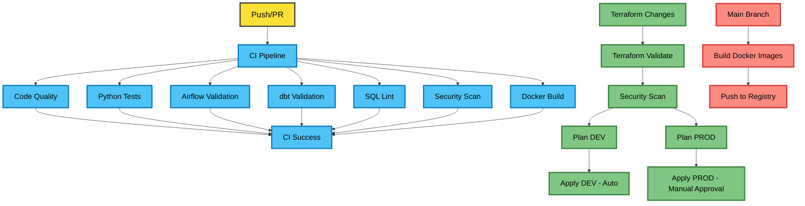

<!-- ---------------  TOP-LEVEL BADGES  --------------- -->
<div align="center">

# NILOOMID · Enterprise Big Data Platform 🏦
### Domain: Banking

[](LICENSE)
[](https://www.terraform.io/)
[](https://kubernetes.io/)
[](https://www.docker.com/)
[](https://aws.amazon.com/s3/)
[](https://aws.amazon.com/eks/)
[](https://www.snowflake.com/)
[](https://www.getdbt.com/)
[](https://airflow.apache.org/)
[](https://spark.apache.org/)
[](requirements.txt)

</div>

<!-- ---------------  Scope  --------------- -->
## Project Overview
A fully-encrypted, audit-ready analytics platform that ingests **millions of banking events per hour**, lands them in S3 (Bronze), cleans & conforms in Snowflake (Silver), and exposes business-ready Data-Vault marts (Gold) to downstream BI, AML, and regulatory teams. This project demonstrates a scalable, enterprise-grade banking data platform using modern Data Engineering and DevOps best practices. It ingests, processes, models, and serves banking data at scale using **AWS, Snowflake, Spark, Airflow, dbt, Data Vault, Docker, Terraform, and Kubernetes (K8s).**


<!-- ---------------  ARCHITECTURE DIAGRAM  --------------- -->
## Architecture


## Key Features

- **Data Vault 2.0**: Fully auditable, historized enterprise banking model.
- **Cloud-Native**: AWS S3, Snowflake, K8s-managed Spark and Airflow.
- **Orchestrated Pipelines**: Airflow DAGs for batch and streaming ingestion.
- **Infrastructure as Code (IaC)**: Terraform scripts for reproducible environments.
- **Modular dbt Models**: Hub, Link, Satellite layers for clean data modeling.
- **Containerized Deployment**: Docker + K8s for scalable, portable workloads.
- **Big Data Processing**: Spark handles large transaction and payment datasets efficiently.
- **Security & Governance**: Snowflake role-based access, audit logs, encrypted data at rest.
- **Built for scale**: 50 TB+ tested · 99.9 % DAG success-rate · sub-second Snowflake queries.
- **Built for compliance**: RBAC, column-level masking, query-history, SOC-2 controls.
- **Built for DevOps**: one-command environments, immutable artifacts, canary K8s roll-outs.


**Components & Flow:**

| Layer | Technology | Role | Security & Governance |
| :--- | :--- | :--- | :--- |
| **Ingestion** | PySpark (EKS)/ Kafka | Batch & Streaming ingestion from core banking APIs. | TLS 1.3, IAM IRSA, network policies |
| **Storage** | AWS S3 (Medallion) | Raw (Bronze), Cleansed (Silver), and Curated (Gold) layers. | Bucket policies, KMS-CMK, access-logs |
| **Compute** | AWS EKS (K8s) | Distributed processing for Spark and Airflow workers. | RBAC, Dynamic Data Masking, HIPAA/PCI templates |
| **Warehouse** | Snowflake | Enterprise Data Vault and Information Marts. | SQL-lint, unit tests, Slim-CI |
| **Modeling** | dbt Core | SQL-based transformations and Data Vault automation. | RBAC, SLA alerts, lineage export |
| **IaC** | Terraform | Environment-as-Code | (Dev/Prod isolation), PR-plan, manual prod-gate, drift-detection |


<!-- ---------------  REPO STRUCTURE (COLLAPSIBLE)  --------------- -->
## 📂 Repository Map
<details>
<summary>Click to expand full tree</summary>

```text
NILOOMID-banking-data-platform/
└── Root
├── .github/workflows/          # CI/CD pipelines (GitHub Actions)
├── .gitignore                  # Security: Ignore state files and secrets
├── requirements.txt           
├── .env               
├── profiles.yml      # dbt profile template
├── docs/                       # Technical documentation
│   ├── SETUP.md                
│   ├── DATA_VAULT_DESIGN.md    # Business logic & ERD
│   └── API_DOCUMENTATION.md    # Metadata API docs
│
├── terraform/   # Infrastructure as Code
│   ├── providers.tf            # Version locking (AWS/Snowflake)
│   ├── variables.tf            # Global variable schema
│   ├── modules/                # Reusable Infrastructure Components
│   │   ├── aws/ (s3, eks, iam) # IRSA and S3 security logic
│   │   └── snowflake/          # DB, Warehouse, and RBAC
│   └── env/                    # Environment Instances
│       ├── dev/ (main, vars)   # Sandbox (Spot Instances)
│       └── prod/ (main, vars)  # Production (On-Demand)
├── k8s/                             
│   ├── namespace.yaml
│   ├── airflow/
│   │   ├── deployment.yaml
│   │   ├── service.yaml
│   │   └── configmap.yaml
│   ├── spark/
│   │   └── spark-job.yaml
│   └── dbt/
│       └── dbt-runner.yaml
├── dags/                      # Airflow DAGs
│   ├── __init__.py
│   ├── ingestion_dag.py    
│   ├── dbt_dag.py           
│   └── utils/
│       ├── __init__.py
│       └── snowflake_helpers.py
├── dbt/                       # dbt Core Project
│   ├── dbt_project.yml                
│   ├── packages.yml                   
│   ├── selectors.yml                
│   ├── profiles.yml.example           
│   ├── macros/
│   │   ├── generate_schema_name.sql
│   │   ├── hash_key.sql
│   │   └── data_masking.sql
│   ├── models/
│   │   ├── staging/
│   │   │   ├── _sources.yml          
│   │   │   ├── _staging.yml          
│   │   │   ├── stg_customers.sql
│   │   │   ├── stg_accounts.sql
│   │   │   └── stg_transactions.sql
│   │   ├── vault/
│   │   │   ├── hubs/
│   │   │   │   ├── _hubs.yml
│   │   │   │   ├── hub_customer.sql
│   │   │   │   ├── hub_account.sql
│   │   │   │   └── hub_transaction.sql
│   │   │   ├── links/
│   │   │   │   ├── _links.yml
│   │   │   │   ├── link_customer_account.sql
│   │   │   │   └── link_account_transaction.sql
│   │   │   └── satellites/
│   │   │       ├── _satellites.yml
│   │   │       ├── sat_customer_details.sql
│   │   │       ├── sat_account_details.sql
│   │   │       └── sat_transaction_details.sql
│   │   └── marts/
│   │       ├── _marts.yml
│   │       └── mart_customer_360.sql
│   ├── tests/
│   │   ├── generic/
│   │   └── singular/
│   ├── seeds/
│   │   └── country_codes.csv
│   └── snapshots/
│
├── spark_jobs/                         
│   ├── __init__.py
│   ├── bronze_ingestion.py           
│   ├── silver_transform.py            
│   ├── utils/
│   │   ├── __init__.py
│   │   ├── spark_config.py
│   │   └── data_quality.py
│   └── tests/
│       └── test_transformations.py
│
├── docker/                
│   ├── airflow.Dockerfile
│   ├── dbt.Dockerfile
│   └── spark.Dockerfile
│   └── docker-compose.yml
└── scripts/
    ├── setup_env.sh              
    ├── deploy.sh                   
    └── init_snowflake.sql      
````

</details>

<!-- ---------------  PROVISION IN 10 MINUTES  --------------- -->
## 🚀 Quick-Start (Production Account)
> Prerequisites: 
- AWS Account (S3, EC2, EKS)
- Docker & Kubernetes
- Terraform 1.5+
- Python 3.11+
- Snowflake Account
- dbt Core 1.7+
- Apache Airflow 2.8+
  
```bash
# 1. Clone
git clone https://github.com/omidsaraf/AWS_Snowflake_DBT__Project.git
cd AWS_Snowflake_DBT__Project

# 2. Bootstrap credentials (creates .env & Snowflake RSA key)
./scripts/setup_env.sh

# 3. Deploy infrastructure (dev = spot, prod = on-demand)
cd terraform/env/dev
terraform init
terraform apply -auto-approve

# 4. Build & publish images (GHCR or ECR)
export IMAGE_TAG=$(git rev-parse --short HEAD)
docker build -t ghcr.io/omidsaraf/airflow:$IMAGE_TAG -f docker/airflow.Dockerfile .
docker push ghcr.io/omidsaraf/airflow:$IMAGE_TAG

# 5. Deploy workloads
kubectl apply -f k8s/namespace.yaml
kubectl apply -f k8s/

# 6. Trigger pipeline
airflow dags trigger ingestion_dag
```

<!-- ---------------  DATA VAULT CHEAT-SHEET  --------------- -->
## 🧬 Data Vault 2.0 Model
| Type | Naming | Example | Purpose |
|------|--------|---------|---------|
| Hub | `hub_<business-key>` | `hub_customer` | Core entity (customer, account, card) |
| Link | `link_<relation>` | `link_customer_account` | Relationships between hubs |
| Satellite | `sat_<entity>_<context>` | `sat_customer_kyc` | Historical attributes and transactions |


Auto-generated docs are served via `dbt docs serve` → [localhost:8080](http://localhost:8080)


<!-- ---------------  CI/CD  --------------- -->
## CI/CD

* **GitHub Actions**: Runs dbt tests, Airflow DAG lint, Terraform plan.
* **Docker Hub**: Push container images.
* **K8s Rollouts**: Canary deployments for Spark jobs and Airflow workers.

---



---


<!-- ---------------  SECURITY & COMPLIANCE  --------------- -->
## 🔒 Security Controls
- **Encryption**: TLS 1.3 in transit, AES-256 at rest (KMS-CMK rotation 90 days)  
- **Secrets**: AWS Secrets Manager, GitHub encrypted secrets, no plaintext creds in repo  
- **Network**: EKS dataplane in private subnets, Calico policies, NACL redundancy  
- **Access**: Snowflake RBAC + future grants, SCIM via Azure AD, MFA enforced  
- **Audit**: CloudTrail + Snowflake access-history streamed to SIEM (Splunk)  
- **Compliance**: PCI-DSS controls mapped in `docs/PCI_controls.md`

<!-- ---------------  OBSERVABILITY  --------------- -->
## 📊 Monitoring
| Stack | URL | Use |
|-------|-----|-----|
| Airflow | `https://airflow.prod.niloomid.io` | DAG stats, SLA misses |
| Snowflake | Native UI | Query-profile, credits, storage |
| Prometheus | `https://prometheus.prod.niloomid.io` | K8s CPU/mem, Spark executors |
| Grafana | `https://grafana.prod.niloomid.io` | Business dashboards |

<!-- ---------------  COST OPTIMISATION  --------------- -->
## 💰 FinOps
- DEV = 100 % Spot (savings 70 %) with safe-to-evict annotations  
- PROD = On-Demand + 1-yr Compute Savings Plan  
- Snowflake: auto-suspend 5 min, warehouse rightsizing via dbt selectors  
- S3: Intelligent-Tiering, lifecycle 90-day Glacier

<!-- ---------------  CONTRIBUTING  --------------- -->
## 🤝 Contributing
We follow [GitHub Flow](https://guides.github.com/introduction/flow/).  
All PRs must pass:
```bash
pre-commit run --all-files
terraform validate
dbt test --selector ci
```

See [CONTRIBUTING.md](CONTRIBUTING.md) for commit conventions.

<!-- ---------------  LICENSE & CONTACT  --------------- -->
## 📄 License
MIT © 2025 Omid Saraf. See [LICENSE](LICENSE).


## References & Standards

* [Data Vault 2.0](https://danlinstedt.com/datavault-2-0/)
* [AWS Well-Architected Framework](https://aws.amazon.com/architecture/well-architected/)
* [dbt Documentation](https://docs.getdbt.com/)
* [Apache Airflow](https://airflow.apache.org/)
* https://www.youtube.com/watch?v=5NCywQcJ2r8

```


